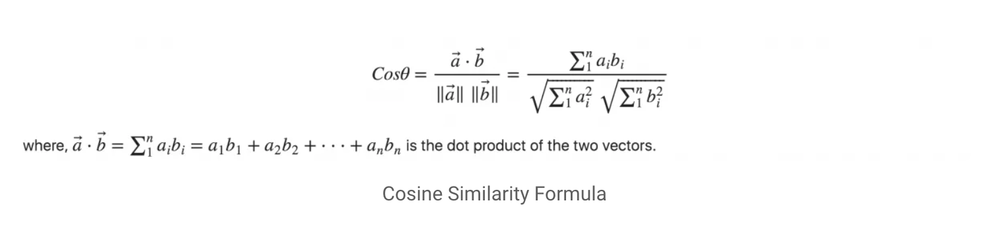

## Sentence to Sentence Semantic Similarity

## Team 3:
- Zoe Lie - zoelie
- Sonia Mannan - smannan
- Poojitha Vaddey - poojithavaddey
- Dylan Zhang

## Abstract

## Experiments/Analysis

Before performing experiments, sentences were pre-processed into numerical vectors using a variety of approaches.
Afterwards, we used cosine similarity to measure the distance between the vectors, creating our own calculated "score".
Calculated scores were compared against real scores determined by human readers using Pearson's correlation, which
measures the strength in correlation between two variables. Ideally calculated scores should be highly correlated to
actual scores, so a higher Pearson's would indicate a better calculated score and pre-processing technique.

Cosine similarity measures the cosine of the angle between two vectors and is a good distance measure for comparing
documents that are different sizes. It is calculated by taking the dot product between the vectors and dividing by
their magnitudes (see formula below). Cosine similarities can range between 0-1, where more similar documents will
have a score of 1.

## Comparisons:

## Conclusion

## Citation
1. Sentence Transformers: https://pypi.org/project/sentence-transformers/
2. BERT: https://keras.io/examples/nlp/semantic_similarity_with_bert/
