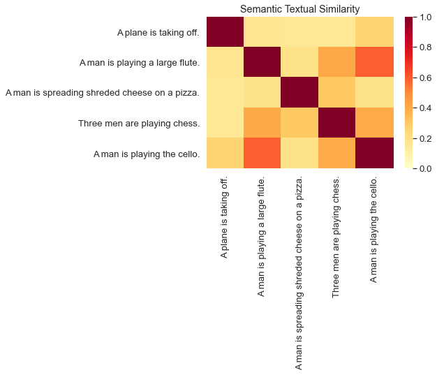

## Sentence to Sentence Semantic Similarity

## Team 3:
- Zoe Lie - zoelie
- Sonia Mannan - smannan
- Poojitha Vaddey - poojithavaddey
- Dylan Zhang - ddyy814

## Abstract

Our team aimed to evaluate sentence semantic similarity using a variety of pre-processing approaches. Semantic
similarity means that the sentence and word context is accounted for when determining how similar two sentences
are. For example, "This article is not about a dog" and "I love articles about dogs!" both contain the word "dog"
but are not talking about the same thing. Semantic similarity is useful across a wide range of NLP tasks such as:
returning relevant articles in a search result, communicating with virtual assistants, or making recommendations
for new posts to view on a social media platform.

Text must be preprocessed into numerical vectors before analyzing because most algorithms cannot work with text
data firsthand. Once processed the numerical vectors can be scored and compared to a baseline similarity determined
by human readers for evaluation. Our team used the STS Benchmark dataset comprised of thousands of news headline
article pairs, scored by human readers for similarity. We applied various preprocessing techniques including: BERT,
Infosert, and Sent2Vec to convert text data into numerica vectors, scored similarity between sentence pairs using
cosine distance, and evaluted our calculated similarities to the human reader's using Pearson's correlation coefficient.

A higher correlation between calculated and actual scores indicates better performance of the preprocessing
technique at representing the sentences. In addition to determining similarities within article headlines our team also wanted
to cluster the headlines to see if any apparent patterns or topics arose. We used the highest scoring preprocessing
technique to prepare the documents and applied k-means clustering, then looked at individual clusters to determine topics.
From this we discovered the headlines clustered into common news topics such as: Foreign Affairs, Military, Dogs, and Finance.

## Background

Two key calculations used to evaluate model performance are cosine similarity and pearson's correlation.

Cosine similarity measures the cosine of the angle between two vectors and is a good distance measure for comparing
documents that are different sizes. It is calculated by taking the dot product between the vectors and dividing by
their magnitudes (see formula below). Cosine similarities can range between 0-1, where more similar documents will
have a score of 1.

Pearson's Correlation measures the linear correlation between two variables from -1 to 1, with 1 being complete positive
correlation, 0 being no correlation, and -1 being complete negative correlation. It's calculated by dividing the covariance
between the two variables, divided by their standard deviation (see formula below). Covariance measures the joint variability
between two variables (if they behave the same it is positive and otherwise negative) while standard deviation measures
the dispersion in a dataset (low standard deviation means values are all close to the mean, higher means they are spread out
over a wide range).

## Experiments/Analysis

### BERT

The part of DistilBert's code is taken from Facebook XLM code, and part of the code is taken from Google AI BERT's Hugging Face PyTorch version. This code is available in the NLP library for Hugging Face, and NLP library also contains training and fine-tuned versions of DistilBert and its reproduction code.

BERT is not too new in terms of model structure and can achieve good results, mainly due to the robust feature extractor Transformer and the two self-supervised language models, which is the beginning of ImageNet in the field of NLP. Use a small number of specialized field forecasts to fine-tune and thus achieve objective results.

In this work, we denote the number of layers (i.e., Transformer blocks) as L, the size of hidden as H, and the number of self-attention heads as A. In all cases, the size of the feed-forward/filter is set to 4H, i.e., 3072 if H = 768. The paper reports results for two model sizes.

  __BERT_BASE: L=12, H=768, A=12, Total Parameters=110M__   __BERT_LARGE: L=24, H=1024, A=16, Total Parameters=340M__

As we can see, the overall structure of BERT is a stack of transformers, and each column of transformers has the same operation, which is the complete input of the sequence, so there is not much difference between BERT and transformers. In the following, we will look at the language model used in BERT and how some specific tasks are accomplished, which will inspire us to have more solutions in our algorithm development.

__Model Performance: DistilBERT Testing:__

The DistilBERT model was proposed in the article post Smaller, faster, cheaper, lighter: Introducing DistilBERT, a distilled version of BERT, and the paper DistilBERT, a distilled version of BERT: smaller, faster, cheaper and lighter. DistilBERT is a small, fast, cheap and light Transformer model trained by distilling BERT base. It has 40% less parameters than bert-base-uncased, runs 60% faster while preserving over 95% of BERT’s performances as measured on the GLUE language understanding benchmark.

We have read several articles comparing the performance of DistilBERT on the development set of the GLUE benchmark with the performance of two baseline models. The BERT base (DistilBERT's faculty model) and a strong non-transferer baseline model from New York University: ELMo + BiLSTMs.The researchers used the ELMo baseline jiant library published by New York University and the PyTorch-Transformers version of the BERT baseline model.

As shown in the table below, DistilBERT does not perform badly with 1/2 and 1/3 of the number of parameters of the baseline model. On nine tasks, DistilBERT's performance is generally equal to or better than the ELMo baseline (14 percentage points more accurate on the QNLI task). We can see that DistilBERT's performance is comparable to BERT: with 40% fewer parameters than BERT, it achieves 95% of the latter's accuracy.

- MNLI (Multi-Genre Natural Language Inference): Given a pair of sentences, the goal is to predict whether the second sentence and the first sentence are related, unrelated, or contradictory.
 
- QQP (Quora Question Pairs): Determines whether two questions have the same meaning. 

- QNLI (Question Natural Language Inference): The sample is (question, sentence) whether or not the sentence is the answer to the question in a piece of text. 

- STS-B (Semantic Textual Similarity Benchmark): Given a pair of sentences, evaluate the degree of semantic similarity between them on a scale of 1 to 5. 

- MRPC (Microsoft Research Paraphrase Corpus): Sentence pairs are derived from comments on the same news article. Determine if the sentence pairs are semantically identical. 

- RTE (Recognizing Textual Entailment): A binary classification problem, similar to MNLI, but with much fewer data. 

- SST-2 (The Stanford Sentiment Treebank): Single-sentence binary classification problem, where the sentence is derived from people's evaluation of a movie, to determine the sentiment of the sentence. 

- CoLA (The Corpus of Linguistic Acceptability): One-sentence binary classification problem, judging whether an English sentence is grammatically acceptable. 

From the results in the table above, it can be seen that DistilBERT is 60% faster and smaller than BERT, and DistilBERT is 120% faster and much smaller than ELMo+BiLSTM.

To further test the speed-up/size trade-off of DistilBERT, we decided to use the DistilBERT model on the STS-B development set as part of the project.

### InferSent

### Universal Sentence Encoders

There are a variety of methods to preprocess text such as Bag of Words and TF-IDF but so far these methods have failed to
accurately represent word context and have not performed well at determining similarity. Recently research has instead focused
on neural and deep learning networks to discover context between words.

Neural nets are composed of neurons, units that take the weighted sum of a set of inputs and apply a non-linear function on 
the ouput. Neurons are connected in layers, with connections to previous and future layers. The weight of each connection 
indicates how important the previous neuron is to the next. Finally, weights are updated during a process called backpropagation
to minimize some loss function.

In 2013 a team of researchers at Google published a paper proposing the method "Word2Vec", using neural networks to capture
word context and numerically reprsent text. They proposed two neural networks: CBOW and Skipgram. CBOW takes a window of words
around a target word, and given the window, or context, tries to predict the target word. The output vector, or embedding, contains weights
indicating how related each word is to every other in the vocabulary. After one pass, each context word should be most related
to the target. This loss is then used to update weights during backpropagation such that the output vector after training
accurately represents each word and its context.

Skipgram is similar but does the opposite of CBOW - given a target word it attempts to predict its context, which words will
appear around it. It updates output weights to minimize the loss between predicted weights for the context, target pair.

The above techniques are used to numerically represent individual words but fall short at representing sentences and documents.
In 2018 Cer et al, another team of researchers at Google, proposed the "Universal Sentence Encoder" model to solve this.
They proposed two model types to combine individual words embeddings: a Deep Averaging Network (DAN) and a Transformer network.

The DAN averages embeddings for words and bigrams then inputs them into another deep feedforward neural network to produce
condensed sentence embedding. This approach is simpler and more efficient but doesn't take word ordering into account, although
performs well on classification tasks.

The transformer uses an attention mechanism to focus on specific words, producing an embedding for the word that accounts for
both order and context. The sentence embedding is then produced by taking the sum of the weights for each word from all the
attention vectors. Transformers are more accurate but also less efficient to train and predict.

The researchers trained the initial model on Wikipedia data and used transfer learning to fine-tune the model to other domains
such as: movie reviews, sentiments, customer reviews, and the STS Benchmark. They used Skipgram as the initial embeddings and
found that the transformer model performed better on the STS Benchmark than the DAN but took longer to train.

Pretrained models are available on tensorflow hub and were used evaluate sentence similarity on our dataset. The following heatmap
shows similarities between 5 sample sentences from the dataset. Most sentences are not similar to each other, but some
sentences such as "A man is playing a large flute" are similar to "Three men are playing chess" and "A man is playing the cello".

### Natural Language Toolkit - analysis

We were analyzing a number of the most frequent words by using NTLK this time. One of the reasons we wanted to do was find the top 15 most frequent words in the training dataset and see if there were particular keywords. We can also use the result to suppose or predict what the next word is in the sentence.

### K-means Clustering

In addition to developing models that can determing how similar two sentences are, we also wanted to cluster news article headlines to
investigate if any apparent topics arose. We used K-means clustering to do this, which is an unsupervised clustering method that
places similar observations in the same cluster based on distance to the cluster's mean. K-means requires numerical data to work with
so in order to cluster the article headlines, the pre-processing techniques in Part I were used as features for this model.

K-means places observations into a fixed amount of clusters so choosing the right number of clusters is key. It has to be small enough
such that the clusters are meaningful but large enough such that the clusters are distinct. We used the elbow method and WCSS to
estimate the number of clusters. WCSS or Within cluser sum of squares is the sum of observation distances from the mean. A small WCSS indicates
cohesive observations in the same cluster, close to their cluster mean. There is a diminishing return on WCSS as cluster size increases.
When there are no longer significant decreases in WCSS, the optimal number of clusters has been found. Based on the chart below, our elbow
was wide and we ended up choosing 20 clusters.

K-means is an unsupervised method but because the sentences used came in pairs scored by humans for similarities, we tried evaluating the
performance of our algorithm by calculating the percent of pairs in the same cluster for each similarity score (0-5). The idea being that
as similarity increases the % of pairs in the same cluster should also increase.

After clustering the article headlines into 20 clusters we inspected sentences in each one to determine if there was a cohesive topic.
We found 15 of the 20 clusters has non-ambiguous themes common to news articles such as: Syria, News About the Middle East, Dogs, Foreign Events, Cooking, Women, Men, Israel and Palestine, Finance, Music, Military, Crime, Cats.

For example, some of the topics we discovered and the article titles in each topic:

Finance Articles:

The bailout was bigger than TARP Bloomberg news.
Scenario A assumes that the CO growth rate accelerates by .%/yr.
Capital gains, top rate:  percent.
If you want to buy $ billion in XYZ Inc. common stock, who cares?
Capital gains, top rate:  percent.
In afternoon trading in Europe, France's CAC-40 advanced and Britain's FTSE 100 each gained 0.7 percent, while Germany's DAX index rose 0.6 percent.
Earlier this month, RIM had said it expected to report second-quarter earnings of between 7 cents and 11 cents a share.

Syria Articles:

Explosion hits oil pipeline in Syria's Homs
Syria says suicide bomber kills 10 in Damascus
Syrian rebels move command from Turkey to Syria
Annan warns talks of Syria risks
UN Security Council unanimous vote on Syria
China news agency: Still hope for Syria peace
U.S. and Turkey weigh no-fly zones for Syria

Music Articles:

A kid is playing guitar.
A boy is playing guitar.
A man is playing guitar.
A little boy is playing a keyboard.
A man is playing a guitar.
A man is playing the guitar.
A man is playing the drums.
A man is playing the guitar and singing.

Dog Articles:

The puppy played with a blue tennis ball.
A dog licks up a baby's drool.
Two dogs swim in a pool.
A dog is looking into swimming pool.
A dog is barking at a ball.
A dog sat at the counter of a store.
A puppy is sliding backwards along the floor.
A dog is looking into swimming pool.

## Comparisons:

The goal for this project is to develop accurate, condensed, numeric representations for text such that the contextual
similarity for two documents can be compared. Text must be pre-processed before analyzed because most algorithms cannot
work with textual data firsthand, so this preprocessing step is key in analyzing text data and is evaluted using the methods
below:

Afterwards, we used cosine similarity to measure the distance between the vectors, creating our own calculated "score".
Calculated scores were compared against real scores determined by human readers using Pearson's correlation, which
measures the strength in correlation between two variables. Ideally calculated scores should be highly correlated to
actual scores, so a higher Pearson's would indicate a better calculated score and pre-processing technique.

Each analysis technique along with their respective Pearson's Correlation Coefficient value is listed in the table below. We have multiplied the Pearson's Correleation Coefficient by 100 for better readability.

| Analysis Technique | Pearson's Correlation Coefficient |
|      :---:         |               :---:               |
| BERT | ___ |
| InferSent | 72.37 |
| Universal Sentence Encoders | 77.85 |
| ___ | ___ |

## Conclusion

## Citation
1. Sentence Transformers: https://pypi.org/project/sentence-transformers/
2. BERT: https://keras.io/examples/nlp/semantic_similarity_with_bert/
3. Cosine Similarity: https://en.wikipedia.org/wiki/Cosine_similarity
4. Pearsons Correlation: https://en.wikipedia.org/wiki/Pearson_correlation_coefficient
5. CBOW and Skipgram Diagrams: https://towardsdatascience.com/introduction-to-word-embedding-and-word2vec-652d0c2060fa
6. Universal Sentence Encoder: https://arxiv.org/pdf/1803.11175.pdf
7. SentenceTransformer Pretrained Models: https://docs.google.com/spreadsheets/d/14QplCdTCDwEmTqrn1LH4yrbKvdogK4oQvYO1K1aPR5M/edit#gid=0
8. BERT：用于语义理解的深度双向预训练转换器（Transformer）: https://carrylaw.github.io/anlp/2018/11/07/nlp14/
9. DistilBERT: https://huggingface.co/transformers/model_doc/distilbert.html#distilbertmodel
10. Is NLP actually advancing? Have we actually cracked the Linguistic learning with deep learning model: Turning-NLG by Microsoft.: https://medium.com/thecyphy/is-nlp-actually-advancing-a27173e7e9b1
11. NLTK: https://www.nltk.org/book/ch01.html#fig-tally
12. InferSent: https://github.com/facebookresearch/InferSent
