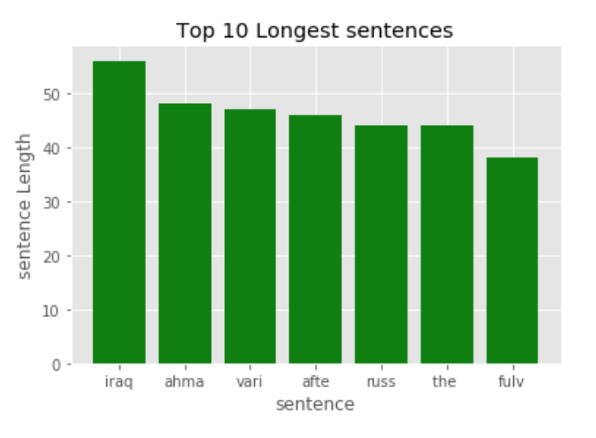

## Sentence to Sentence Semantic Similarity

## Team 3:
1. Zoe Lie - zoelie
2. Sonia Mannan - smannan
3. Poojitha Vaddey - poojithavaddey
4. Dylan Zhang - ddyy814

## Description
We propose evaluating sentence similarity based on thousands of sentence pairings from various news articles, 
online forums, and images captions since the Semmantic Textual Similarity(STS) measures the degree of equivalence
in the underlying semantics of paired snippets of text. The STS benchmark tasks are building algorithms and computational models to solve the 
deep natural language understanding problem and provide a standard setup for training, development, and testing on three selected genres.

We select the STS benchmark because the SemEval (Semantic Evaluation) shared task has been updated dataset annually since 2012 in order to stimulate research in semantic 
analysis and encourage the development of creative new methods to the modeling sentence level.

Sentence similarity is used in a range of Natural Language Processing tasks - when you type in a search and Google is able to recommend similar searches, when you ask 
Siri a question it can return a variety of results based on similar requests, or correcting grammatically incorrect sentences. These use cases demonstrate natural 
language processing has huge potential to change how well we communicate online, which is why we chose to focus on sentence similarity.


## Dataset
STS Benchmark: http://ixa2.si.ehu.es/stswiki/index.php/STSbenchmark

## Balance dataset before training

We consider use re-sampling tecniques to balance the training datset.

1. Oversampling (draw more sample without substitution) from underrepresented class
2. Undersampling (draw less sample with/without substitution) from overrepresented class
3. Over-sampling followed by under-sampling (SMOTE + Tomek links or SMOTE + ENN)
4. Ensemble classifier using samplers internally (such as Easy Ensemble classifier)

## Potential methods
In the process of natural language processing, we often encounter scenarios where we need to find similar sentences or find approximate expressions of sentences.
For the problem of distance calculation, we will take a look at how to use Python to calculate sentence similarity.

We propose various pre-preocessing techniques and distance measures to evaluate how similar two sentences are. A distance measure is a mathematical formula specifying
how similar two sentences are. Distance measures therefore require text data to be pre-preocessed before it can be evaluated and the pre-processing technique used can
heavily influence the similarity evaluation of a sentence pair.

We propose the following pre-processing techniques:

1. TF-IDF score: Each word in the sentence gets a score weighted by its frequency and importance to the sentence. Each sentence will be represented by a vector of TF-IDF scores.
2. Bag of Words: Each sentence is represented by list of 1's and 0's where as 1 indicates the sentence contains a specific word. We can experiment with both words and
N-germs (N-length substrings in the sentence).
3. Word embeddings: Use a neural network to weight each word based on their similarities and context within the sentence. Each sentence is represented by a compressed 
N-length vector of weights.
4. Sentence embeddings: A similar method to word embeddings but weights are learned based on sentence similarity, not word.

And the following distance measure:
1. Edit Distance (Levenshtein): The edit distance algorithm refers to the minimum number of edit operations required to convert two strings from one to the other.
The greater the distance between them, the more different they are. The permitted edting operations inclue replacing one character with another, inserting a character, and deleting a character. This method does not require any pre-processing.

2. Jaccard index (Jaccard) - The Jaccard index is used to compare the similarities and differences between a limited sample dataset. The larger the Jaccard index coefficient
value, the higher the sample similarity. The calculaiton method of the Jaccard index is straightforward. It is the value obtained by dividing the intersection
of two sample by the union. When the two samples are the same, the result is 1, and when the two samples are completely different, the result is 0. This method can be
used to evaluate a Bag of Words Model.

3. Cosine Similarity: Measures the cosine of the angle between two vectors. The similar the angle, the larger the consine similarity is, and the more similar two documents are.
This measurement is good for documents that can be different sizes. This measure can be used to evaluate TF-IDF and embedding vectors.

## Meausre success in this project

The STS dataset is manually annotated by humans who score each sentence pair from 0 - 5 based on how similar they are. To evaluate we can scale each of our distance measures between 0 - 5 and compare the distance measure we calculated to the annoated similarity based on RMSE for each pre-processing technique.

RMSE or Root mean squared error is an average measure of the magnitude of error from calculated similarities to actual ones. A lower RMSE would indicate a more accurate pre-processing technique.

## Preliminary Analysis

There are 5,749 training sentence pairs and 1,379 testing sentence pairs for a total 7,128 sentence pairs with train-test split of 80:20. Each sentence pair was rated manually with a score from 0-5 based on how similar they were. These similarity scores are evenly slightly skewed towards a score of 3.0 or "somewhat similar" sentences but are otherwise evenly distributed.


The sentence pairs were gathered from news articles and in terms of total vocabulary size, there were 114,346 words in the training set, with 18,348 of them unique. After accounting for case and removing common stop words such as a, and, the, etc.. the vocabulary size was 16,315 words.

The most common words included those such as man, woman, dog, playing, and white:


In terms of word length the average word was about 7 characters long, with the shortest word at 1 character and the largest at 48 characters. The 90th percentile word length was 10.


In terms of sentence length the average sentence was 10 words long, with the minimum at 2 words, and the longest at 56 words. The 90th percentile sentence length was 18 words.



Most counted sentences such as in Sentence_1(column) in traning dataset 


According to the basic analysis of the training dataset, the frequent number is 16 in Sentence_1 (column). After computing, obtaining the most counted sentence in Sentence_1 and plot the chart with pie. Each sentence only represents a percentage of the result with the top 5 counted instead of a percentage of all training data sets.

Most counted sentences such as in Sentence_1(column) in testing dataset 


According to the basic analysis of the testing dataset, the frequent number is 9 in Sentence_1 (column). After computing, obtaining the most counted sentence in Sentence_1 and plot the chart with pie. Each sentence only represents a percentage of the result with the top 5 counted instead of a percentage of all testing data sets.

Here are the 10 most common sentences in the training and testing datasets visualized as bar charts.


Upon further analysis of the similarity scores in the training and testing datasets, the following statistics were found:

Statistics for similarity scores in training dataset
```
count    5749.000000
mean        2.700999
std         1.464398
min         0.000000
25%         1.500000
50%         3.000000
75%         3.800000
max         5.000000
```

Statistics for similarity scores in testing dataset
```count    1379.000000
mean        2.607917
std         1.525517
min         0.000000
25%         1.315000
50%         2.800000
75%         3.800000
max         5.000000
```
The respective statistics of the mean and standard deviation for the training and testing dataset are approximately the same.

Here are 5 of the most and least similar sentences of the training and testing datasets, as sorted by similarity score:


After viewing these figures, it is clear how the similarity score is generated. Sentences that ultimately mean the same thing and have very similar words are rated with a similarity score of 5. On the other hand, sentences that mean different things and have very different words are rated with a similarity score of 0.

## Cite
1. Imbalanced-learn: https://github.com/scikit-learn-contrib/imbalanced-learn
2. How to fix imbalanced dataset? https://towardsdatascience.com/having-an-imbalanced-dataset-here-is-how-you-can-solve-it-1640568947eb
3. TF-IDF: https://monkeylearn.com/blog/what-is-tf-idf/
4. Dataset Hub: https://github.com/brmson/dataset-sts
